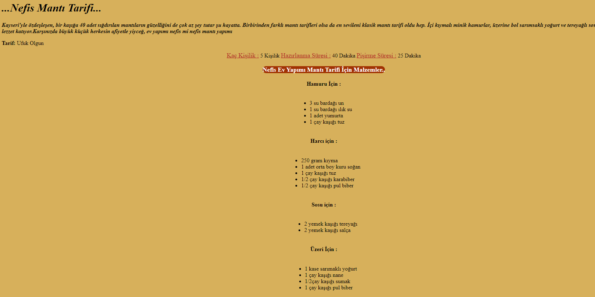
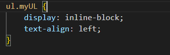

# Html&Css ile Yemek Tarif Sayfası Yapımı

- Sayfayı oluşturuken Css konusuna çok hakim olmadığım için bir kaç zorluklar çıktı.

  > Bu zorlukları da Google amca sayesinde halletim.

- İlk zorluğum yazıları ortalarken liste elemanlarının "marker" ların sayfanın solunda yazıların ise style : text-center verdiğim için yazıların sayfanın merkezinde olması
  >   
  >  çözümü ise liste elemanlarını inline-block yapmak.
  > https://www.w3schools.com/howto/howto_css_center-list.asp
